# 📊 Metrics

Data and other metrics using [lowlighter/metrics](https://github.com/lowlighter/metrics).

[GitHub Actions](.github/workflows) run once daily to create/update the [SVG](svg) files.

## Blog posts

## RSS Notes

## RSS Tutorials

## GitHub Base

## GitHub Recent Activity

## GitHub Notable Contributions

## Github Starred Topics

## GitHub Languages

## GitHub Starlists

## GitHub Mild Facts

## Dev.to entries

## Websites

### Screenshot

### Lighthouse Results

<!-- ## Full Metrics

 -->
